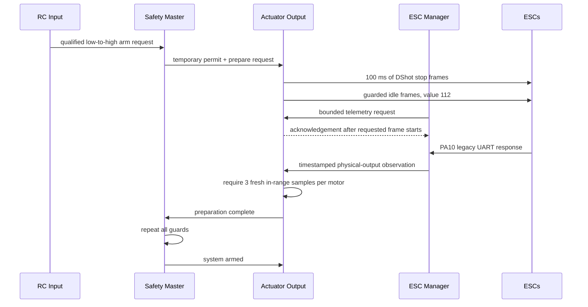

# Arming and Safety Logic

## Authority Boundary

FerroWasp separates an arm request, protocol-specific actuator preparation,
and the final armed state.

```text
RC input requests arming.
Safety Master grants or revokes a temporary preparation permit.
Actuator Output alone writes motor hardware and proves preparation complete.
Safety Master alone declares the system armed.
```

Telemetry, the ESC manager, USB, OSD, and experiments do not own arming or
motor authority.

| Function | Authority owner |
|---|---|
| Arm/disarm decision | Safety Master |
| Temporary actuator preparation permit | Safety Master |
| Motor peripheral access | Actuator Output |
| Protocol-specific preparation and completion report | Actuator Output |
| Motor command generation | Control Loop |
| Motor command application | Actuator Output |
| RC arm/throttle intent | RC Input |
| ESC telemetry parsing and response association | ESC Manager |

## Shared Arming Guards

An arm attempt requires:

- a qualified RC link;
- a newly observed low-to-high arm transition;
- arm high for the configured 200 ms hold;
- throttle at or below `ARMING_MAX_THROTTLE`, currently 65 command counts;
- a supported IMU that has produced a sample;
- completed stationary startup gyro-bias calibration;
- a fresh IMU sample in the control loop;
- no revoked actuator permit or other failed safety check.

These IMU conditions are checked before actuator preparation, throughout its
10 ms guarded waits/eRPM qualification, and again before the final armed
transition. Repeated samples do not advance gyro-bias calibration. Host tests
cover unavailable, uncalibrated, and stale rejection; deliberate target fault
injection remains follow-up evidence.

The RC link starts invalid and becomes healthy after three valid SBUS frames.
It expires after 100 ms without a healthy frame. Booting or recovering the
link while arm is already high cannot request arming; the input must first be
observed low and then transition high.

During actuator preparation, the actuator owner rechecks its permit, RC
armability, arm state, throttle, and IMU health every 10 ms. Any failure selects
stop before publishing an arming-abort reason.

## Default FCU3 and Foxeer DShot Sequence

The default FCU3 and Foxeer paths use telemetry-qualified DShot arming:

1. Safety Master enters `Arming`, grants the temporary permit, and asks
   Actuator Output to prepare the ESCs.
2. Actuator Output selects four DShot stop values for a guarded 100 ms dwell.
3. It applies idle command `65`, mapped to DShot value `112`, under the
   temporary permit. The system is still not armed.
4. After a 250 ms spin-up grace, Actuator Output consumes timestamped,
   physical-output-associated observations published by the ESC manager.
5. Every motor must supply three consecutive fresh observations between 3,000
   and 10,000 eRPM before the 1.2-second qualification deadline.
6. Only after all four motors qualify does Actuator Output report preparation
   complete.
7. Safety Master repeats the arming guards and may then enter `Armed`.
8. Only in `Armed` may normal control commands be applied.

Missing, zero, or stale RPM fails at the deadline. An RPM above the ceiling
fails immediately after the grace period. An invalid qualification profile
also fails. Every failure selects four stop values and leaves the system
disarmed.

The ESC manager waits five seconds after boot before issuing its first
telemetry request. An arm attempt that enters guarded idle before enough
requests can run may reach the 1.2-second deadline without qualifying samples,
fail closed, and stop all outputs. The switch must then be observed low before
a fresh low-to-high request can start another attempt.

Power the ESCs before the manager's first post-delay request. If the FC runs
without ESC power long enough for that request to time out, telemetry is
latched off until reboot. After applying ESC power, reboot the FC and complete a
fresh switch-low/low-to-high arm sequence.

The ESC manager does not decide whether RPM is sufficient and cannot change
the safety state. It only owns UART parsing, request rotation, response
association, timeouts, and publication of observations. The safety-owned
actuator path owns the qualification decision.

A CRC-valid UART frame can complete while its operation is still queued. The
manager may buffer that frame, but it remains quarantined and is published only
after the exact sequence/output frame-start acknowledgement arrives from the
DShot service. Association timeouts latch telemetry off until reboot so late
traffic cannot be relabeled. UART, parser, bounded-queue, and timeout failures
cannot grant authority; when they prevent required pre-arm samples,
qualification fails closed. Telemetry loss after `Armed` is currently
observational and does not itself disarm.

ESC-manager identity is physical-output identity: output 1 is logical
M4/front-left, output 2 is M3/rear-left, output 3 is M1/rear-right, and output
4 is M2/front-right. The default DShot image runs this PA10 legacy telemetry
path.



The core event remains named `ActuatorIdling` for compatibility. It means that
DShot qualified all four idle RPMs under the temporary preparation permit. It is not itself an
armed signal.

## Standard DShot Preparation

Both flight boards use the guarded DShot sequence: a 100 ms stop-frame dwell,
then telemetry-qualified idle under a temporary permit, followed by the safety
master's final guard. There is no app-level PWM ESC sequence.

## Normal Motor-Command Path

```text
Control Loop -> bounded SPSC MotorCmd queue -> Actuator Output -> motor hardware
```

The control loop is the only `MotorCmd` producer. The actuator wake carries no
motor values; it only asks the sole consumer to drain to the newest queued
command. Actuator Output requires the system to be armed and validates command
age, finiteness, and range before applying it. Disarm and arming entry discard
data from the previous arm cycle.

The current freshness check runs when Actuator Output is woken. An independent
deadline that detects complete absence of future control-loop wakes remains
open.

## Failure Responses

| Condition | Required response |
|---|---|
| Arm high at boot or link recovery | Remain disarmed until a fresh low-to-high transition |
| Invalid RC link | Revoke permission, disarm, select stop |
| Arm switch drops during preparation | Select stop within one guard interval and abort |
| Throttle rises above the arming limit | Select stop within one guard interval and abort |
| DShot RPM evidence missing, zero, or stale | Abort at the bounded deadline and select four stops |
| DShot idle RPM above the ceiling | Abort after spin-up grace and select four stops |
| Invalid DShot qualification configuration | Abort and select four stops |
| Missing/stale/invalid armed motor command | Reject it and select the safe protocol response |
| DShot lease or frame-set deadline expires | Select stop, fault the bank as applicable, and request disarm |
| Explicit disarm | Clear armed/permit/preparation state and select stop |

## Safety Invariants

```text
Only Safety Master may declare Armed.
Only Actuator Output may write motor hardware.
Preparation-complete does not imply Armed.
Normal motor commands require Armed and a fresh SPSC command.
Arming failure selects stop before reporting failure.
Disarm clears the armed state and temporary permit.
Telemetry and ESC-manager faults cannot grant motor authority.
```

## Recorded Target Checks

Powered props-off evidence covers:

- three successful four-motor DShot idle qualifications at approximately
  6,500-7,100 eRPM;
- an injected physical-output-1 / logical-M4 zero-eRPM condition that failed
  after 1.2 seconds, named the unproven output, selected sustained stop, and
  never emitted `SYSTEM ARMED`;
- active-command RC loss selecting stop, arm-high recovery remaining disarmed,
  and a fresh low-to-high transition restoring the normal guarded sequence;
- explicit disarm selecting four stops;
- power interruption and reflashing while arm remained high stopping the
  motors and not automatically rearming after reboot, by operator observation.

RTT records state, requested output, telemetry, and backend counters but does
not measure the electrical stop latency. DShot pulse timing/jitter and precise
stop latency remain instrumented checkpoints.
