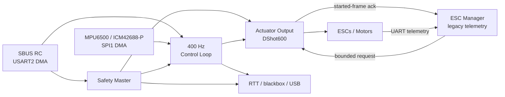

# FerroWasp

FerroWasp is a safety-focused Rust/RTIC flight-controller firmware project for
multicopter UAVs. It favors explicit resource ownership, deterministic
scheduling, bounded interfaces, and a small codebase that can be inspected as
a whole.

The Foxeer F405 V2 is the golden flight target. FerroWasp FCU3 remains a
supported secondary flight target, while NUCLEO-F401RE provides a
non-actuating STM32F4 development target. See [Current Support](current_support.md)
for the board and feature matrix.

## Where to Begin

- To install and operate a packaged Foxeer image, use the
  [User Guide](user/getting_started.md).
- To build, test, or contribute from source, use the
  [Developer Setup](developer_getting_started.md).
- To understand the current implementation, browse the flight-controller,
  interface, and development chapters in the [Summary](SUMMARY.md).

## Runtime Shape

FerroWasp is open source under the Apache License, Version 2.0. The firmware is
experimental and is not a stable or production flight stack. See
[Publication and Licence](publication_status.md) for the complete status and
disclaimer links.
