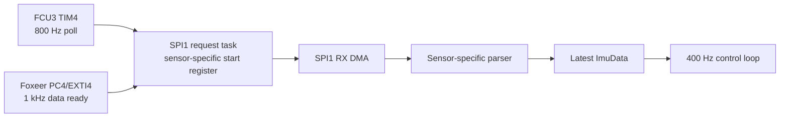

# IMU

FerroWasp currently supports MPU6500 and ICM42688-P devices over SPI1.

## Target Selection

| Board | IMU behavior |
|---|---|
| FerroWasp FCU3 | Fixed MPU6500 path, `WHO_AM_I=0x70` |
| Foxeer F405 V2 | Mode-3 probe selects MPU6500 `0x70` or ICM42688-P `0x47` |
| NUCLEO-F401RE | No attached IMU in the board contract |

An unsupported identity, failed probe, failed reset, or configuration
read-back failure leaves Foxeer sampling disabled. The heartbeat and unrelated
bring-up services continue, while the runtime IMU health gate rejects arming.

## Driver Behavior

Both drivers are allocation-free modules in `ferrowasp-drivers` and use
`embedded-hal` 1.0 traits for blocking boot configuration.

MPU6500 support includes:

- device and signal-path reset
- SPI-only mode and `WHO_AM_I` validation
- 1 kHz gyro sampling with DLPF
- +/-2000 dps gyro and +/-8 g accelerometer ranges
- the 14-byte accel/temperature/gyro burst beginning at `0x3b`

ICM42688-P support includes:

- soft reset and reset-complete validation
- `WHO_AM_I=0x47` validation and bank-0 selection
- I2C disabled while big-endian sensor output is preserved
- register read-back before sensor power-up
- 1 kHz low-noise gyro and accelerometer output
- +/-2000 dps gyro and +/-16 g accelerometer ranges
- the required power transition and gyro startup delays
- active-high, push-pull, pulsed INT1 data-ready routing, including the required
  `INT_ASYNC_RESET` clearing
- the 14-byte temperature/accel/gyro burst beginning at `0x1d`
- temperature and physical-unit conversion helpers

SPI helpers always attempt to deassert chip select after a bus failure. Burst
decoders reject short, all-zero, and all-`0xff` frames.

## Runtime Flow

The two sensor layouts both fit the existing fixed 15-byte full-duplex DMA
transaction: one read-command byte plus 14 response bytes.



`SpiDmaOwner` exclusively owns SPI1, both DMA halves, chip select, timeout
recovery, and static receive buffers. The parser returns each receive buffer
after valid and invalid frames.

Foxeer configures both supported sensors for active-high, push-pull data-ready
pulses and triggers sampling from PC4/EXTI4. The IRQ timestamps and clears the
edge before deferring the bounded SPI request; it performs no blocking bus
work. RTT heartbeat diagnostics expose IRQ and rejected-trigger totals plus
their two-second deltas. FCU3 retains its existing 800 Hz timer poll trigger.

## Axis And Rate Convention

Raw values remain in sensor-axis order. Each board support supplies the axis indices and
signs used to produce measured roll, pitch, and yaw rates for the control loop.

The Foxeer-only `imu_orientation_rtt` feature adds one low-rate, coherent
sensor-frame snapshot to the existing heartbeat. It reports acceleration in
mg, uncorrected gyro in tenths of a degree per second, and temperature in
tenths of a degree Celsius without changing the USB protocol or taking a
shared RTIC lock. A second line reports the board support-mapped drone-frame gravity
vector and gyro rates for direct implementation validation:

```powershell
python tools\terminal_embed.py --board foxeer-f405-v2 --release --locked --features imu_orientation_rtt --probe-speed-khz 1800 --connect-under-reset
```

FCU3's mapping and gyro bias behavior have bench evidence. Foxeer's fitted
sensor identity, package orientation, body-axis map, and signs must be checked
on the physical board before its arming inhibit can be removed.

The optional BB2 `gyro10` values use the same measured-rate convention passed
to the rate PID. Host viewers should display those roll, pitch, and yaw fields
directly.

See [RTT Debug Tools](./rtt_debug_tools.md) for the terminal logger and live
IMU viewer.

## Foxeer Bring-Up Checklist

1. Flash with motor power and props disconnected.
2. Record the supported identity log: decimal `112` for MPU6500 or `71` for
   ICM42688-P.
3. Confirm the PC4/EXTI4 delta is approximately 2,000 per two-second heartbeat,
   sequence numbers advance, rejected-trigger counts remain zero or explainably
   bounded, and no SPI timeout or invalid-frame warning appears.
4. Enable `imu_orientation_rtt` and check stationary acceleration magnitude,
   gyro noise, and temperature.
5. Hold the board level, then move it slowly nose-up, right-side-down, and
   clockwise in yaw. Sustain each motion for at least four seconds so a
   two-second orientation snapshot lands during it, then hold and pause before
   the next motion. Record both sensor-frame axes/signs and the mapped body
   response. Positive body roll lowers the right side, positive pitch raises
   the nose, and positive yaw turns the nose right viewed from above.
6. Run a five-minute sample/heartbeat soak.
7. Measure PC4 data-ready polarity, pulse width, cadence, and edge-to-DMA-start
   latency with a logic analyzer.
8. Keep the board arming inhibit in place until orientation and motor waveform
   evidence is reviewed.

## Roadmap

- propagate the captured hardware-edge timestamp into estimator sample metadata
- validate ICM42688-P filter delay and sample timing on Foxeer
- add fault reporting for invalid or out-of-range samples
- add BMI088 support
- move more sensor-independent processing out of the RTIC app shell
