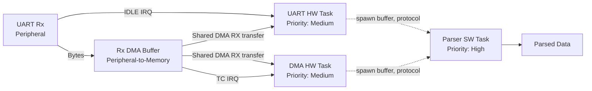
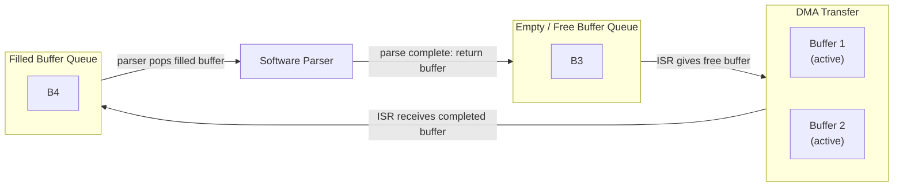

# UART

UART support is divided into two layers:

- **HAL layer**
- **Software layer**

The **HAL layer** is implemented per hardware abstraction layer, such as `stm32f4xx-hal`.
The **software layer** is common across supported hardware platforms.

---

## UART Rx DMA Data Flow

The UART receiver uses DMA to store incoming bytes directly into a memory buffer instead of interrupting the CPU for every received byte.

When the UART peripheral detects an **IDLE condition**, it triggers the UART IDLE interrupt. In this design, the IDLE interrupt indicates that the current frame has likely ended. The CPU then fetches the data already written into the DMA buffer and gives the DMA transfer a fresh empty buffer.

Alternatively, if the DMA buffer becomes full, the DMA switches to the second buffer and raises the **Transfer Complete (TC)** flag. The CPU then fetches the completed buffer and provides another free buffer to the DMA transfer.

The IDLE and TC interrupts are handled by separate hardware tasks with the same priority. This allows the shared DMA transfer resources to be coordinated without mutex contention. When a hardware task receives a completed buffer from the DMA transfer, it pushes that buffer into the filled queue and spawns a software parser task.

The parser task type depends on the protocol enum, which configures the parser used for that UART instance.



---

## UART Rx Buffer Ownership

The receiver uses four buffers. Each buffer has a fixed memory region assigned to it. This is required because the DMA transfer object writes incoming UART data from the UART Rx peripheral into a specified region of memory.

When the CPU gives the DMA transfer a new buffer, it transfers ownership of that buffer and provides a pointer to its memory region. The DMA transfer does the same when it hands a filled buffer back to the CPU:

```rust,ignore
let (filled_buffer, _) = transfer.next_transfer(free_buffer.take().unwrap()).unwrap();
```

Since the DMA transfer uses double buffering, it must always own two buffers:

- one buffer currently being written by DMA
- one buffer that can be replaced by the CPU with a fresh buffer

The software parser also needs to own a buffer while it parses received data. This means that at least three buffers are required during normal operation.

A fourth buffer is added so the CPU usually has a free buffer available if the DMA transfer completes before the software parser has finished parsing its current buffer.

---

## Buffer Queues

Two heapless queues are used to track buffer ownership:

```rust,ignore
let mut free_queue: ferrowasp_stm32f4::uart_dma::FreeQueue = Queue::new();
let mut filled_queue: ferrowasp_stm32f4::uart_dma::FilledQueue = Queue::new();
```

The queues have the following roles:

- **free queue**: contains empty buffers that can be given to the DMA transfer
- **filled queue**: contains completed buffers waiting to be parsed

The parser task continuously pulls buffers from the filled queue until it is empty. After parsing a buffer, the parser returns it to the free queue.

The hardware task takes buffers from the free queue and gives them to the DMA transfer. If the free queue is empty when the DMA transfer requests a new buffer, the hardware task returns an error.

For the UART4 MSP/OSD, USART2 SBUS, and FCU3 PA10 / USART1 ESC-telemetry paths,
the IRQ owner adds one portable ownership step after detaching the static DMA
buffer. USART1 uses DMA2 Stream 5 Channel 4:

```text
filled DMA buffer
    -> copy bytes and metadata into bounded RxChunk
    -> recycle DMA buffer immediately
    -> SerialReader (`embedded_io_async::Read`)
    -> incremental protocol parser
```

`RxChunk` carries the IDLE/full completion cause, generation, timestamp, and
continuity markers. Queue overflow is reported through a separate
`DiscontinuityReader`; protocol framing and DMA chunk boundaries remain
independent. USART2 wakes one persistent async SBUS parser. Its safety path
observes both parser results and out-of-band discontinuities so transport loss
can invalidate RC state immediately.

In the default FCU3 DShot image, USART1 feeds the low-priority ESC manager's
ten-byte BLHeli legacy parser. This service is part of the standard flight image. The manager owns framing, CRC validation, response association,
samples, and timeouts. UART transport or parser state cannot command motors:
telemetry-bit requests cross a bounded queue to the safety-owned DShot actuator
service. A CRC-valid frame that arrives while its request is still queued can
be buffered, but it remains quarantined and is published only after the manager
receives the matching sequence/output acknowledgement for a frame that
actually started.

Transport, parser, queue, and timeout faults cannot grant actuator authority.
If they withhold the fresh observations required during guarded idle, pre-arm
qualification times out and returns all four outputs to stop. Telemetry loss
after arming is currently observational and does not itself request disarm.

---

## Buffer Flow



The normal ownership cycle is:

```text
Free queue → DMA transfer → Filled queue → Parser → Free queue
```

---

## Buffer Ownership Invariants

The buffer system must maintain the following invariants:

1. The total number of buffers is always four.
2. Each buffer has exactly one owner at any time.
3. The DMA transfer owns exactly two buffers during normal operation.
4. The parser owns a buffer only while it is actively parsing that buffer.
5. A buffer must not be returned to the free queue until parsing is complete.
6. A buffer must not be handed to the DMA transfer unless it came from the free queue.

